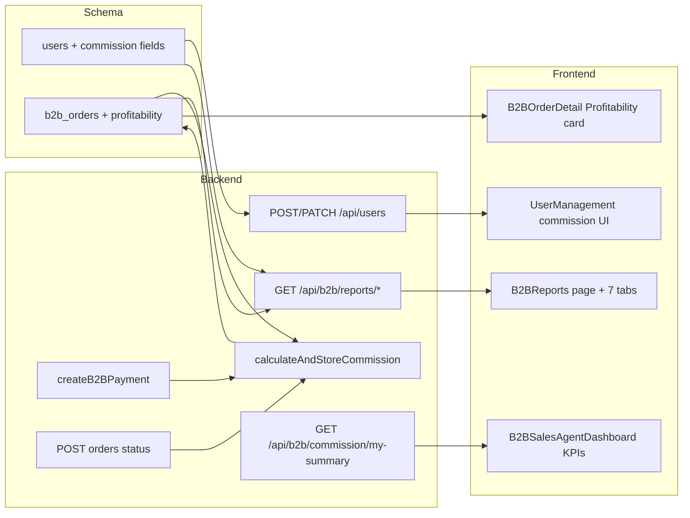

# B2B Commission System and Corporate Reports – Plan

## Objective

Add a commission system for B2B Sales Users (per piece and per order types) with auto-calculation on order completion + full payment, visible to both Sales Agents and Super Admin. Add a comprehensive B2B Corporate Reports tab with 7 report types, filters, and Excel export.

---

## Architecture Overview

---

## Phase 1: Schema (T001, T002)

### T001: Commission fields on Users

**File:** `shared/schema.ts`

- Add enums (near other B2B enums, ~line 27):
  - `b2bCommissionTypeEnum`: `["per_piece", "per_order"]`
  - `b2bCommissionModeEnum`: `["fixed", "percentage"]`
- In `users` table (lines 67–78), add:
  - `commissionType` — `b2bCommissionTypeEnum`, nullable
  - `commissionValue` — `decimal("commission_value", { precision: 10, scale: 2 })`, nullable
  - `commissionMode` — `b2bCommissionModeEnum`, nullable (used when `commissionType === "per_order"`)
- Ensure insert/select types include new columns (createInsertSchema will pick up new columns).
- Run `npm run db:push` to migrate.

**Acceptance:** Users table has the three commission columns; DB migrated successfully.

---

### T002: Profitability fields on B2B Orders

**File:** `shared/schema.ts`

- Add enum: `b2bCommissionStatusEnum`: `["pending", "earned"]`.
- In `b2bOrders` table (lines 362–408), add:
  - `salesAgentCommission` — decimal(10,2), default `"0"`
  - `productCost` — decimal(10,2), default `"0"`
  - `earning` — decimal(10,2), default `"0"`
  - `commissionStatus` — `b2bCommissionStatusEnum`, default `"pending"`
- Run `npm run db:push`.

**Acceptance:** B2B orders table has the four profitability columns; DB migrated successfully.

---

## Phase 2: User Management commission UI and API (T003)

### T003: Commission fields in User Management

**Backend**

- **server/routes.ts:** In `POST /api/users` (line ~301) and `PATCH /api/users/:id` (line ~336), allow and pass through `commissionType`, `commissionValue`, `commissionMode` from `req.body` into the payload sent to storage.
- **server/storage.ts:** In `createUser` and `updateUser`, include the new fields in the insert/update so they are persisted.

**Frontend**

- **client/src/pages/UserManagement.tsx:**
  - Extend `UserData` and `formData` with `commissionType`, `commissionValue`, `commissionMode` (nullable/optional).
  - B2B role detection: treat a role as "B2B" if it has any of `create_b2b_orders`, `view_b2b_orders`, `view_b2b_dashboard`. Check `role.permissions` if `/api/roles` returns permissions; otherwise use role name or a known B2B role list.
  - In the create/edit dialog, after Role and Active Status, add **Commission Settings** section visible only when the selected role is B2B:
    - **Commission Type:** dropdown "Per Piece" / "Per Order".
    - If **Per Piece:** number input "Amount per piece (₹)" bound to `commissionValue`; hide `commissionMode`.
    - If **Per Order:** **Commission Mode** toggle "Fixed Amount" / "Percentage". Fixed: "Commission amount (₹)". Percentage: "Commission %". Bind to `commissionValue` and `commissionMode`.
  - On edit, prefill commission fields from `editingUser`. On submit, send commission fields in create/update payload.

**Acceptance:** Super Admin can set commission type and value when creating/editing B2B users; values persist and show when editing.

---

## Phase 3: Commission auto-calculation (T004)

### T004: Calculate and store commission (Backend)

**New helper:** `calculateAndStoreCommission(orderId: string)`.

**Location:** Implement in `server/routes.ts` (local async function near B2B routes after `canViewAllB2BData`) or in new `server/services/commission.ts` and call from routes.

**Logic:**

1. Fetch order: `storage.getB2BOrderById(orderId)`. If not found or no `createdBy`, return.
2. **Eligibility:** Only when **both** `paymentStatus === "fully_paid"` and `status` is `"delivered"` or `"closed"`. If not, return.
3. **Idempotency:** If `commissionStatus === "earned"`, return.
4. Fetch sales agent: `storage.getUserById(order.createdBy)`. If no commission settings, set commission to 0; still compute product cost and earning.
5. **Commission:**
   - **Per piece:** `commissionValue * sum(item.quantity)` (₹ per piece).
   - **Per order fixed:** `commissionValue` (flat).
   - **Per order percentage:** `(commissionValue / 100) * totalAmount`.
6. **Product cost:** For each `order.items` with `productVariantId`, call `storage.getProductVariantById(item.productVariantId)` and add `parseFloat(variant.costPrice) * item.quantity`. Sum = `productCost`. Missing variant → 0 for that line.
7. **Earning:** `totalAmount - productCost - salesAgentCommission`.
8. **Persist:** `storage.updateB2BOrder(orderId, { salesAgentCommission, productCost, earning, commissionStatus: "earned" })`. Ensure `updateB2BOrder` accepts these fields.

**Hooks:**

- **After B2B payment makes order fully_paid:** In the route `POST /api/b2b/payments` (after `storage.createB2BPayment`), fetch updated order; if `paymentStatus === "fully_paid"` and status is delivered/closed, call `calculateAndStoreCommission(req.body.orderId)`.
- **After B2B order status becomes delivered/closed:** In `POST /api/b2b/orders/:id/status`, after `storage.updateB2BOrderStatus`, if new status is `"delivered"` or `"closed"`, fetch order; if `paymentStatus === "fully_paid"`, call `calculateAndStoreCommission(req.params.id)`.
- **After PATCH payment-status:** In `PATCH /api/b2b/orders/:id/payment-status`, after update, if order is fully_paid and status delivered/closed, call `calculateAndStoreCommission(req.params.id)`.

**Acceptance:** Commission, product cost, and earning auto-calculate when order is fully paid AND delivered/closed; commission status set to earned; no double-add.

---

## Phase 4: Super Admin profitability view (T005)

### T005: Profitability card on B2B Order Detail

**File:** `client/src/pages/b2b/B2BOrderDetail.tsx`

- Add **Profitability** card, visible only to Super Admin (`isSuperAdmin` or equivalent).
- Show: Total Order Value, Product Cost, Sales Agent (name + commission type description e.g. "₹10/pc × 200 pcs" or "5% of ₹50,000"), Sales Agent Commission, Earning (green if positive, red if negative).
- If not yet completed+paid, show "Commission: Pending calculation" in muted text.

**Acceptance:** Super Admin sees full profitability breakdown on each B2B order.

---

## Phase 5: Sales Agent commission visibility (T006)

### T006: Commission for Sales Agents

**Backend**

- **New endpoint:** `GET /api/b2b/commission/my-summary` (auth, B2B permission). Return `{ totalEarned, totalPending }`:
  - `totalEarned` = sum of `salesAgentCommission` for orders where `createdBy === req.user.id` and `commissionStatus === "earned"`.
  - `totalPending` = sum of `salesAgentCommission` for same user where `commissionStatus === "pending"` (or 0 for pending if amounts not stored until earned; task says "Pending = sum where commissionStatus === 'pending'" — can store 0 for pending and show "Pending" count or estimate separately).
- Add storage method e.g. `getB2BCommissionSummaryByAgent(userId)`.

**Frontend**

- **B2BSalesAgentDashboard.tsx:** KPI cards "Total Commission Earned" and "Pending Commission" from `GET /api/b2b/commission/my-summary`.
- **B2BOrderDetail.tsx:** When viewer is the order’s sales agent (and not Super Admin), show **My Commission** mini-card: amount + status. Do not show product cost or earning.
- **B2B orders list:** Add commission column (amount or "Pending"). Agents see only their own; Super Admin sees all.

**Acceptance:** Sales agents see their commission per order and totals on dashboard; they do not see product cost or earning.

---

## Phase 6: B2B Reports page and API (T007–T010)

### T007: B2B Reports page and shell

- **New page:** `client/src/pages/b2b/B2BReports.tsx`.
  - Layout: filter bar at top, tabbed report sections below.
  - **Filter bar:** Date range (Today, This Week, This Month, Last Month, Last 3 Months, Custom), Sales Agent dropdown (Super Admin only), Client dropdown, Order Status multi-select, Payment Status multi-select, Apply Filters, Reset.
  - Add route in `client/src/App.tsx`: `/b2b/reports` → `B2BReports`.
  - In `client/src/components/AppSidebar.tsx`, add under B2B: **Reports** (BarChart3 icon), path `/b2b/reports`, permission `view_b2b_dashboard`.

**Acceptance:** B2B Reports page accessible from sidebar; filter bar renders with all options.

---

### T008: Backend report endpoints

**Files:** `server/routes.ts`, `server/storage.ts`

- All endpoints: auth + `view_b2b_dashboard`. Non–Super Admin: restrict to `createdBy === req.user.id`. Query params: `startDate`, `endDate`, `agentId`, `clientId`, `status`, `paymentStatus`.
- Endpoints:
  - `GET /api/b2b/reports/summary` — total orders, revenue, product cost, commission, earning, orders by status, payment collection rate.
  - `GET /api/b2b/reports/client-wise` — per client: orders count, total qty, revenue, received, pending, commission, earning.
  - `GET /api/b2b/reports/agent-wise` — per agent: clients count, orders count, revenue, commission earned/pending, collection rate.
  - `GET /api/b2b/reports/product-wise` — per product/category: qty, revenue, cost, margin.
  - `GET /api/b2b/reports/status-wise` — orders count and value per status, conversion rates.
  - `GET /api/b2b/reports/payments` — order-level payment details with days overdue.
  - `GET /api/b2b/reports/commissions` — per-order commission breakdown by agent (Super Admin only).
- Add corresponding storage methods for each report.

**Acceptance:** All 7 endpoints return correct aggregated data with filters; agents only see own data where applicable.

---

### T009: Report tabs — Overview, Client-wise, Agent-wise

**File:** `client/src/pages/b2b/B2BReports.tsx`

- **Overview:** KPI row (Total Orders, Revenue, Product Cost, Commission, Earning), revenue trend, orders by status, payment collection rate. Data from summary API.
- **Client-wise:** DataTable (Client, Orders, Total Qty, Revenue, Received, Pending, Commission, Earning), sortable, Export to Excel.
- **Agent-wise:** Super Admin only. Table (Agent, Clients, Orders, Revenue, Commission Earned, Commission Pending, Collection Rate), sortable, Export to Excel.

**Acceptance:** Three tabs render with data from API; sorting and export work.

---

### T010: Report tabs — Product-wise, Status-wise, Payments, Commissions

**File:** `client/src/pages/b2b/B2BReports.tsx`

- **Product/Category-wise:** Table (Product, Category, Qty Ordered, Revenue, Cost Total, Margin), group-by-category summary, Export to Excel.
- **Status-wise:** Table (Status, Order Count, Total Value, % of Total), pipeline conversion rates, Export to Excel.
- **Payment Collection:** Table (Order #, Client, Total, Received, Pending, Payment Status, Days Overdue), highlight overdue, filter by payment status, Export to Excel.
- **Commission Report:** Super Admin only. Table (Agent, Order #, Client, Order Value, Commission Type, Commission Amount, Status), summary row (Total Paid, Total Pending), Export to Excel.

**Acceptance:** All remaining tabs render with correct data; export works for each.

---

## Implementation order

| Step | Task | Blocked by |
|------|------|------------|
| 1 | T001 | — |
| 2 | T002 | — |
| 3 | T003 | T001 |
| 4 | T004 | T001, T002 |
| 5 | T005 | T002, T004 |
| 6 | T006 | T002, T004 |
| 7 | T007 | — |
| 8 | T008 | T002 |
| 9 | T009 | T007, T008 |
| 10 | T010 | T007, T008 |

---

## Notes

- **Product cost:** Order items have `productVariantId`; use `storage.getProductVariantById` for `costPrice`. Schema: `productVariants.costPrice` in `shared/schema.ts` (line ~123). `getB2BOrderById` currently loads `items: { with: { product: true } }`; items have `productVariantId` so commission service can resolve variant per item.
- **B2B role detection (T003):** Use role permissions if `/api/roles` returns them (e.g. from `getRoleWithPermissions`); otherwise check role name or a fixed list of B2B role IDs.
- **Excel export:** Use existing `xlsx` dependency (see `client/src/lib/shopifyImport.ts`). Build workbook from table data and trigger download.
- **Reports permission:** Use `view_b2b_dashboard` for report access; Agent-wise and Commission tabs + agent filter only for Super Admin.
